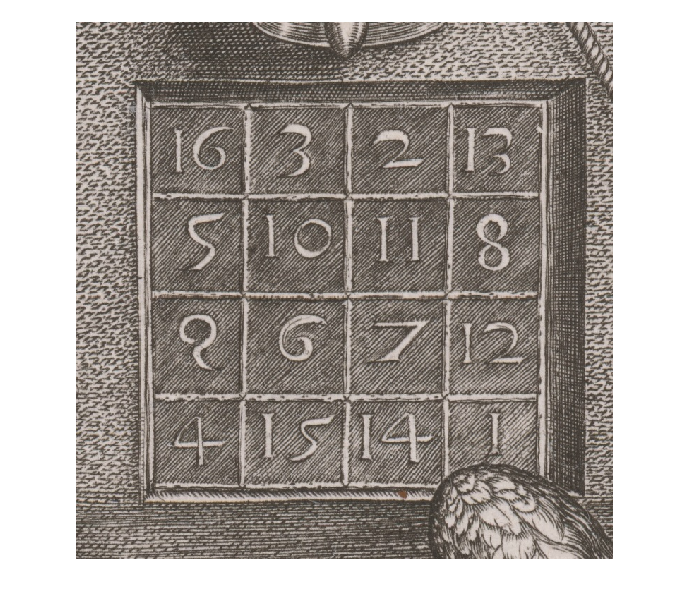

# Dürer v Bratislave?
[](https://matlab.mathworks.com/open/github/v1?repo=MartinFoltin/okno&file=/02_Durer/MagicDurer.mlx)

*(9.5.2025) Martin Foltin*


Posledný januárový deň vyšiel článok v Denníku N „*Dúfame, že sa dozvieme, že máme originál od Dürera, vraví kurátorka Galérie mesta Bratislavy*“. Pod nadpisom slávna grafika \- *Melancolia I*. Až mnou hrklo, či je to skutočne pravda. Melancolia I je významné grafické renesančné dielo. Medirytina sa nezachovala. Odhaduje sa, že asi 200 otlačkov koluje po svete. Nájdeme ich vo významných múzeách a súkromných zbierkach. Žiaľ po prečítaní článku som zistil, že sa senzácia nekoná. Melanchólia v Bratislave určite nie je. 

```matlab
durer_melancolia=imread("Durer_Melancolia_I.jpg");
imshow(durer_melancolia);
```


K obrazu mám vzťah od strednej školy. Videl som ho prvýkrát v príručke k MATLABu. Nájdete ho tam aj dnes. Obraz vyjadruje hlboký a hĺbavý smútok autora. Rozborom celého diela sa zaoberať nebudem. Sústredím sa na pravý horný roh \- magickú tabuľku. Práve táto tabuľka sa využíva pri demonštrovaní, ako prakticky sa v MATLABe pracuje s maticami. Jednoducho ich zadáte do premennej, spravíte súčty v riadkoch, stĺpcoch, na diagonálach. Dürer však magickú tabuľku neumiestnil na svoj obraz preto, aby sme mohli o 500 rokov trénovať indexovanie matíc v MATLABe. Jeho matica má hlbší, veľmi osobný a skoro až magický význam. MATLAB nám pomôže pri odhaľovaní jej odkazu. 

```matlab
durer_magic=imread("Durer_magic.jpeg");
imshow(durer_magic);
```



Najskôr zadajme tabuľku vo forme matice do premennej MA. 

```matlab
MA=[16 3  2  13
    5  10 11  8
    9  6  7  12
    4  15 14  1]
```

```matlabTextOutput
MA = 4x4
    16     3     2    13
     5    10    11     8
     9     6     7    12
     4    15    14     1

```

V MATLABe sa vždy indexuje (riadok,stĺpec). Súradnice (1,1) má pravý horný roh matice. Tak ako sme zvyknutí z matematiky. 

```matlab
MA(1,1)
```

```matlabTextOutput
ans = 16
```

Sčítavanie riadkov a stĺpcov je hračka. 

```matlab
sum(MA) %suma v stĺpcoch
```

```matlabTextOutput
ans = 1x4
    34    34    34    34

```

```matlab
sum(MA,2) %suma v riadkoch
```

```matlabTextOutput
ans = 4x1
    34
    34
    34
    34

```

Využiť by sa dala aj transpozícia matice pomocou symbolu apostrof. Súčty v riadkoch aj stĺpcoch sú vždy rovnaké. 34. Pozrime sa na hlavnú a vedľajšiu diagonálu. 

```matlab
sum(diag(MA)) %suma na diagonále
```

```matlabTextOutput
ans = 34
```

```matlab
sum(diag(rot90(MA))) %vedlajšia diag (anti-diag)
```

```matlabTextOutput
ans = 34
```

A to nie je všetko. Súčet 34 nájdeme aj v submaticiach. Vyberme submatice 2x2 a spravme súčet. 

```matlab
MA(1,1)+MA(1,2)+MA(2,1)+MA(2,2)
```

```matlabTextOutput
ans = 34
```

Takýchto submatíc nájdeme v magickej matici celkom 5. Spolu je možné nájsť 86 štvoríc, kde bude súčet 34. Ostávajúce už netvoria taký pekný a jasný vzor. 


V matici je toho, ale ešte viac. Medirytina vznikla v roku 1514. Je inšpirovaná hlbokým zármutkom autora po úmrtí matky (✝️17.5.1514). 

```matlab
MA(4,2)*100+MA(4,3)
```

```matlabTextOutput
ans = 1514
```

A teraz skúsme sčítať rohy matice. Napr. ľavý horný a pravý dolný. 

```matlab
MA(1,1)+MA(end,end)
```

```matlabTextOutput
ans = 17
```

Alebo ostávajúce rohy.

```matlab
MA(4,1)+MA(1,4)
```

```matlabTextOutput
ans = 17
```

V tabuľke nájdeme odkaz na číslo 17 celkom osemkrát a opäť dvojice tvoria pekné vzory. V matici je aj číslo 5. To odkazuje na mesiac máj. 5 v magickej matici byť musí, tak ako musí prísť koniec všetkého. V spodnom riadku ešte môžeme nájsť čísla 4 a 1. Je to pravdepodobne odkaz na meno autora 4. písmeno v abecede je D ako Dürer, 1 symbolizuje A ako Albrecht. 


Dürer bol prvým európskym umelcom, ktorý zachytil magickú tabuľku vo svojom diele. Zrejme sa inšpiroval tabuľkou, ktorú publikoval jeho súčasník Agrippa. Tá však nezachytáva rok 1514. Preto musel Dürer využiť vlastný um a modifikovať ju, aby tabuľka odkazovala na nešťastnú udalosť a zároveň zachovala svoju mágiu.


 Pôvodný otlačok v Bratislave neuvidíte. Môžete si spraviť výlet do Viedne, Paríža alebo Londýna. Tam sú diela vystavené. Ak sa uspokojíte s digitalizovanou podobou, navštívte stránku [web umenia](https://www.webumenia.sk/en/dielo/SVK:SNG.G_69).

